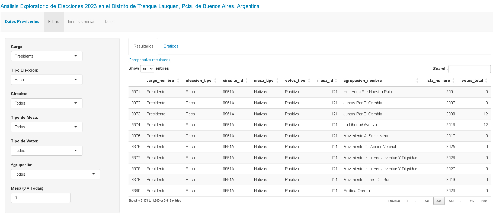
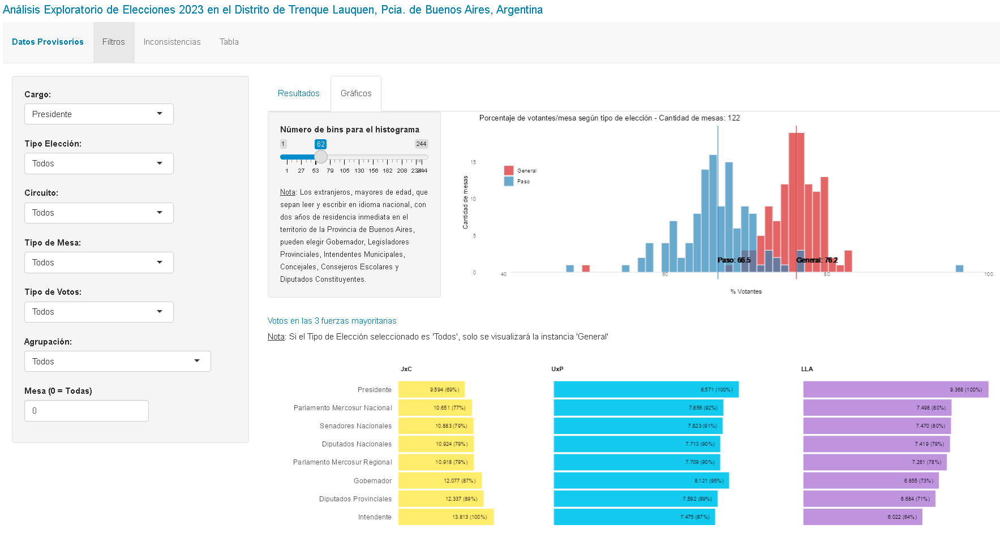
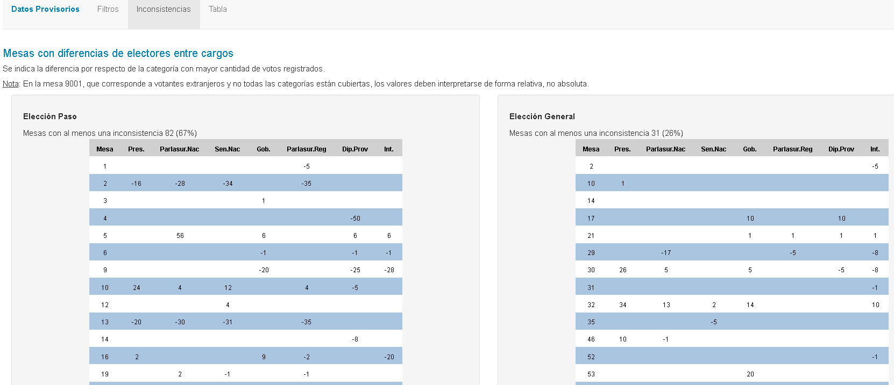
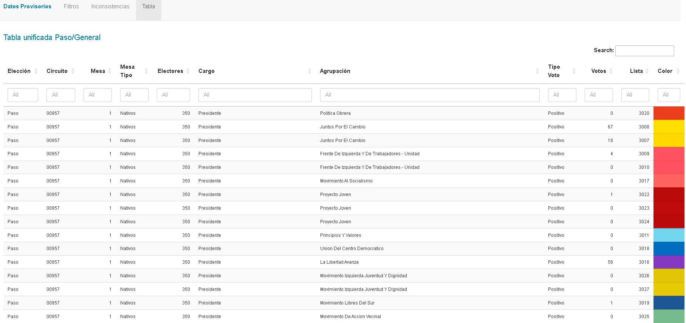

# Análisis de Elecciones en Argentina
# Adaptado al distrito de Trenque Lauquen, Pcia. de Buenos Aires.

## Descripción
Esta es una aplicación Shiny diseñada para realizar un análisis descriptivo de los datos provisorios de las elecciones Primaria y General en Argentina del año actual. La aplicación ofrece varias funcionalidades que permiten explorar los resultados electorales de manera interactiva.

## Funcionalidades

### Panel de Filtros
- **Resultados**: Muestra una tabla de resultados electorales que se actualiza en función de diversos filtros, incluyendo cargo, tipo de elección, circuito electoral, tipo de mesa, tipo de votos, agrupación y mesa. Los datos se refieren al distrito de Trenque Lauquen, Provincia de Buenos Aires.

- **Gráficos**: Ofrece un histograma que muestra la cantidad de electores en las elecciones Primarias y Generales. Los usuarios pueden ajustar el número de bins utilizando un slider. Además, se presentan gráficos que muestran los votos obtenidos por las tres fuerzas políticas mayoritarias para todos los cargos.

### Inconsistencias
- Proporciona acceso a un listado de mesas con inconsistencias en el número total de votos para cada cargo, tanto en las elecciones Primarias como en las Generales. Se muestra el porcentaje de mesas con estas inconsistencias y cómo ha mejorado la situación de una instancia a la otra.

### Tabla de Datos Originales
- Incluye una tabla con los datos originales publicados por la DINE (Dirección Nacional Electoral) para las elecciones Primarias y Generales. Los usuarios pueden realizar búsquedas y aplicar filtros en función de cada variable publicada.

## Cómo usar la aplicación
1. Seleccione los filtros que le interesen en el "Panel de Filtros".
2. Explore los resultados en la tabla y gráficos.
3. Analice las mesas con inconsistencias en el "Panel de Inconsistencias".
4. Consulte los datos originales en la "Tabla de Datos Originales" para obtener más detalles.

## Créditos
Esta aplicación Shiny ha sido desarrollada por [Carlos Marcos](https://twitter.com/_Carlos_Marcos) y se basa en datos proporcionados por la [Dirección Nacional Electoral](https://www.electoral.gob.ar/).

## Contacto
Si tiene alguna pregunta o sugerencia sobre la aplicación, no dude en ponerse en contacto vía Twitter [_Carlos_Marcos](https://twitter.com/_Carlos_Marcos).

¡Disfrute explorando los resultados electorales de Argentina!
